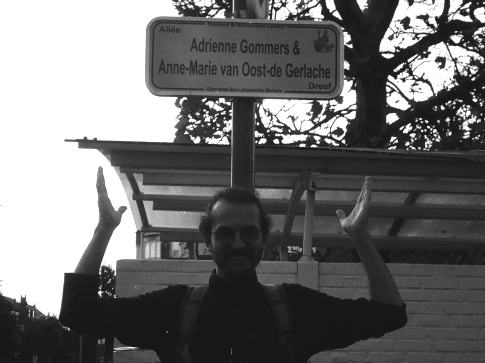
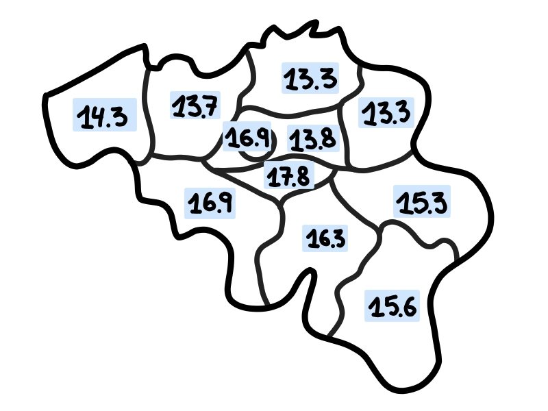

# Le plus long nom de rue en Belgique
Chez moi il y a une rue avec un nom assez long "Tweekleinewegenstraat" (Rue des deux petits chemins).
À part que quelqu'un ne pouvait pas décider si c'était une rue ou deux (petits) chemins, je me suis demandé plusieur fois si ça n'était pas le nom le plus long de Belgique.
Heureusement répondre cette question est plutôt facile aujourd'hui, et en bidouillant avec Python et [OpenStreetMap](https://www.openstreetmap.org) on a la réponse (et plus encore)!

Le code que j'ai utilisé pour cet article se trouve [ici](/files/street-names). 

La rue dans mon quartier, avec ses pauvres 21 caractères, n'est même pas proche du top 10:   

<table>
  <thead>
  <tr>
    <th>Longueur</th>
    <th>Rue</th>
    <th>Place</th>
    <th>Province1</th>
  </tr>
  </thead>
  <tbody>
  <tr>
    <td>56</td>
    <td>Allée Adrienne Gommers & Anne-Marie van Oost-de-Gerlache</td>
    <td>Woluwe-Saint-Lambert</td>
    <td>Bruxelles</td>
  </tr>
  <tr>
    <td>45</td>
    <td>Rue de l'Institut Notre-Dame de la Compassion</td>
    <td>La Louvière</td>
    <td>Hainaut</td>
  </tr>
  <tr>
    <td>44 (50)</td>
    <td>Rue de la 7e Division d'Infanterie Française</td>
    <td>Ethe</td>
    <td>Luxembourg</td>
  </tr>
  <tr>
    <td>44</td>
    <td>Burgemeester Charles Rotsart de Hertainglaan</td>
    <td>Maldegem</td>
    <td>Flandre-Orientale</td>
  </tr>
  <tr>
    <td>44</td>
    <td>Burgemeester Karel Lodewijk Verbraekenstraat</td>
    <td>Sint-Gillis-Waas</td>
    <td>Flandre-Orientale</td>
  </tr>
  <tr>
    <td>43 (58)</td>
    <td>Rue du 127e Régiment d'Infanterie Française</td>
    <td>Couvin</td>
    <td>Namur</td>
  </tr>
  <tr>
    <td>43 (53)</td>
    <td>Rue du 113e Régiment d'Infanterie Française</td>
    <td>Musson</td>
    <td>Luxembourg</td>
  </tr>
  <tr>
    <td>43</td>
    <td>Rue Baron Ferdinand de Bernard de Fauconval</td>
    <td>Soignies</td>
    <td>Hainaut</td>
  </tr>
  <tr>
    <td>43</td>
    <td>Burgemeester Charles Van Cauwenberghestraat</td>
    <td>Merelbeke-Melle</td>
    <td>Flandre-Orientale</td>
  </tr>
  <tr>
    <td>42 (46)</td>
    <td>Rue du 1er Régiment des Chasseurs à Cheval</td>
    <td>Tournai</td>
    <td>Hainaut</td>
  </tr>
  <tr>
    <td>42</td>
    <td>Albert en Marie-Louise Servais-Kinetstraat</td>
    <td>Woluwe-Saint-Lambert</td>
    <td>Bruxelles</td>
  </tr>
  </tbody>
</table>

_1Je sais que Bruxelles n'est pas une province mais comme ça le tableau reste plus simple!_

## Allée Adrienne Gommers & Anne-Marie van Oost-de-Gerlache
Même si on ne compte pas les espaces, ça fait encore 50 caractères, et ça reste comme même le plus long nom de rue.
L'équivalent néerlandais est 1 caractère plus court, mais seulement parce qu'il n'y a pas d'espace devant _dreef_:  **Adrienne Gommers & Anne-Marie van Oost-de Gerlachedreef**.

Celle-ci [etait inaugurée](https://www.listedubourgmestre-wsl.be/inauguration-de-lallee-adrienne-gommers-anne-marie-van-oost-de-gerlache/) seulement en 2023 et c'est (crois-le ou non) nommé d'aprés Adrienne Gommers et Anne-Marie van Oost-De-Gerlache, 2 femmes de la resistance. Autre fait intéressant: Anne-Marie était mariée au fils de Adrien de Gerlache, qui a fait le premier hivernage en Antartique.

Est-ce un vraie rue? Peut-être. Ça a plutôt l'air d'être un monumont, surtout qu'on ne peut qu'y garer sa voiture, et il n'y a aucun bâtiment avec cette addresse.

## Rue du 127e Régiment d'Infanterie Française

Mais attend, ce n'est pas si simple. En Wallonie il y a beaucoup de rues qui font réference à un régiment d'infanterie, ensemble avec leur nombre relevant. Ici j'ai décidé de ne pas ecrire les nombres entièrement2, car ça n'est presque jamais fait dans la vie quotidienne. Pourtant, je crois que c'est pertinant d'en tenir compte, parce que ces nombres longs ont un impact sur la prononciation.

J'ai noté la longueur des nombres écrit entièrement en parenthèses dans le tableau. Écrit ainsi, le nom de rue le plus long est sans doute **Rue du Cent Vingt-Septième Régiment d'Infanterie Française**.

Apparemment un nom si long est plutot embêtant, et par consequent la plaque est réduite à **Rue du 127 ième RIF**. Pas si long en fin de compte, hein? (Help)

_2Ici j'ai utilisé l'abréviation 'e' en suivant [l'Academie Francaise](https://www.academie-francaise.fr/abreviations-des-adjectifs-numeraux), meme si ce n'est pas toujours respecté dans les plaques de rue..._

## Par province

[[belgie-ingevuld]] montre que tout les provinces francophones ont des noms plus longs que les néerlandophones. En soi ce n'est pas illogique, puisque le forme posséssive dans le néerlandais emploie moins lettres/mots que dans le français.
Prenons par example **Burgemeester Etienne Demunterlaan** et **Avenue du Bourgmestre Etienne Demunter**: 
 Waar ge in het Nederlands gewoon _'laan'_ op het einde kunt toevoegen, moet ge in het Frans _'avenue de'_ gebruiken. Zelfs wanneer het woord korter is in het Frans kan het nog steeds langer uitkomen: _'rue de la'_ is 3 karakters langer dan _'straat'_.

Le gagnant (more) est Brabant Wallon avec une longueur moyenne de 17.8. Anvers et Limbourg sont les deux tout en bas de la liste, bien que Anvers a la place finale avec une longueur moeyenne de 13.25 contre le 13.28 de Limbourg.

## Varia
Enfin j'ai encore trouvé les plus long noms pour quelques categories differentes, notamment  

<table>
  <thead>
  <tr>
    <th>Categorie</th>
    <th>Rue</th>
    <th>Place</th>
    <th>Province</th>
  </tr>
  </thead>
  <tbody>
  <tr>
    <td>Sans espaces</td>
    <td>Onze-Lieve-Vrouw-ten-Spiegelestraat</td>
    <td>Courtrai</td>
    <td>Flandre-Occidentale</td>
  </tr>
  <tr>
    <td>1 mot</td>
    <td>Zandvoordeschorredijkstraat</td>
    <td>Ostende</td>
    <td>Flandre-Occidentale</td>
  </tr>
  <tr>
    <td>Meeste woorden(?)</td>
    <td>Rue du 1er Régiment des Chasseurs à Cheval</td>
    <td>Tournai</td>
    <td>Hainaut</td>
  </tr>
  <tr>
    <td></td>
    <td>Chemin du Point de Vue de la Sibérie</td>
    <td>Profondeville</td>
    <td>Namur</td>
  </tr>
  <tr>
    <td></td>
    <td>Cul de Sac de la rue Des Récollets</td>
    <td>Tournai</td>
    <td>Hainaut</td>
  </tr>
  <tr>
    <td>Allemand</td>
    <td>Kelmiser Mühle Mühlenteichweg</td>
    <td>Kelmis</td>
    <td>Liége</td>
  </tr>
  </tbody>
</table>

