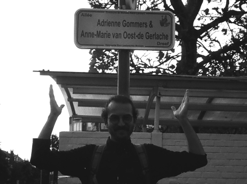
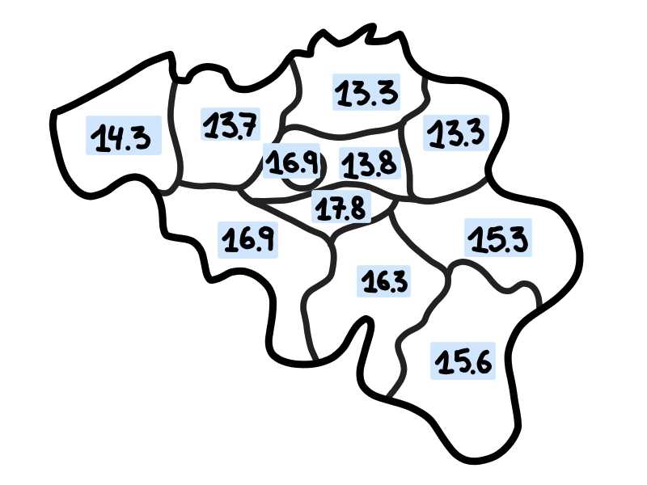

# De langste straatnaam van België

Bij mij in de buurt is er een straat met de behoorlijk lange naam "Tweekleinewegenstraat". 
Buiten het feit dat iemand precies niet kon beslissen of het nu 1 straat is of 2 (kleine) wegen, heb ik mij al vaker afgevraagd of dit niet een van de langere straatnamen in België zou zijn. 
Gelukkig is die vraag beantwoorden tegenwoordig redelijk makkelijk, en een dagje prutsen met Python en OpenStreetMaps geeft ons het antwoord (en meer)!

Mijn lokale straat staat met zijn ocharme 21 karakters niet eens in de buurt van de top 10:

<table>
  <thead>
  <tr>
    <th>Lengte</th>
    <th>Straat</th>
    <th>Plaats</th>
    <th>Provincie1</th>
  </tr>
  </thead>
  <tbody>
  <tr>
    <td>56</td>
    <td>Allée Adrienne Gommers & Anne-Marie van Oost-de-Gerlache</td>
    <td>Sint-Lambrechts-Woluwe</td>
    <td>Brussel</td>
  </tr>
  <tr>
    <td>45</td>
    <td>Rue de l'Institut Notre-Dame de la Compassion</td>
    <td>La Louvière</td>
    <td>Henegouwen</td>
  </tr>
  <tr>
    <td>44 (50)</td>
    <td>Rue de la 7e Division d'Infanterie Française</td>
    <td>Ethe</td>
    <td>Luxemburg</td>
  </tr>
  <tr>
    <td>44</td>
    <td>Burgemeester Charles Rotsart de Hertainglaan</td>
    <td>Maldegem</td>
    <td>Oost-Vlaanderen</td>
  </tr>
  <tr>
    <td>44</td>
    <td>Burgemeester Karel Lodewijk Verbraekenstraat</td>
    <td>Sint-Gillis-Waas</td>
    <td>Oost-Vlaanderen</td>
  </tr>
  <tr>
    <td>43 (58)</td>
    <td>Rue du 127e Régiment d'Infanterie Française</td>
    <td>Couvin</td>
    <td>Namen</td>
  </tr>
  <tr>
    <td>43 (53)</td>
    <td>Rue du 113e Régiment d'Infanterie Française</td>
    <td>Musson</td>
    <td>Luxemburg</td>
  </tr>
  <tr>
    <td>43</td>
    <td>Rue Baron Ferdinand de Bernard de Fauconval</td>
    <td>Soignies</td>
    <td>Henegouwen</td>
  </tr>
  <tr>
    <td>43</td>
    <td>Burgemeester Charles Van Cauwenberghestraat</td>
    <td>Merelbeke-Melle</td>
    <td>Oost-Vlaanderen</td>
  </tr>
  <tr>
    <td>42 (46)</td>
    <td>Rue du 1er Régiment des Chasseurs à Cheval</td>
    <td>Doornik</td>
    <td>Henegouwen</td>
  </tr>
  <tr>
    <td>42</td>
    <td>Albert en Marie-Louise Servais-Kinetstraat</td>
    <td>Sint-Lambrechts-Woluwe</td>
    <td>Brussel</td>
  </tr>
  </tbody>
</table>

_1Ik weet dat Brussel geen provincie is maar zo blijft de tabel simpel!_

## Allée Adrienne Gommers & Anne-Marie van Oost-de-Gerlache

Zelfs als we spaties niet meetellen, is het nog steeds 50 karakters lang, en nog steeds de langste straatnaam.
De Nederlandse tegenhanger is 1 karakter korter, en enkel omdat er geen spatie is voor _dreef_: **Adrienne Gommers & Anne-Marie van Oost-de Gerlachedreef**.

Deze is pas in 2023 [ingehuldigd geweest](https://www.listedubourgmestre-wsl.be/inauguration-de-lallee-adrienne-gommers-anne-marie-van-oost-de-gerlache/) en is (ongelooflijk maar waar) vernoemd naar Adrienne Gommers en Anne-Marie van Oost-de-Gerlache, twee vrouwen die meezaten in het verzet. Ook interessant is dat Anne-Marie getrouwd was met de zoon van Adrien de Gerlache, die de eerste overwintering deed binnen de Antarctische cirkel.

Is dit een echte straat? Misschien. Het voelt eerder aan als een nieuwigheid, vooral omdat ge hier enkel kunt parkeren, en er is bijvoorbeeld geen enkel gebouw met dit adres.

## Rue du 127e Régiment d'Infanterie Française

Maar wacht, zo simpel is het toch niet. Er zijn in Wallonie behoorlijk wat straatnamen die verwijzen naar een infanterieregiment, samen met hun relevante nummer. Hier heb ik besloten om deze niet volledig uit te schrijven2, aangezien dat zelden gedaan wordt in het echte leven. Toch denk ik dat het relevant is om hier rekening mee te houden, aangezien lange nummers wel een impact hebben op de uitspraak.   

De lengte van de straatnaam als we de nummers uitschrijven, staat weergegeven tussen haakjes. In dat geval heeft **Rue du Cent Vingt-Septième Régiment d'Infanterie Française** ongetwijfeld de langste naam.

Blijkt dat zo'n lange straatnaam best vervelend is, met als gevolg dat dit op het straatnaambord wordt verkort tot **Rue du 127 ième RIF**. Zo lang is dat dan toch ineens niet meer.

_2Ik heb hier de afkorting 'e' gebruikt volgens [l'Academie Francaise](https://www.academie-francaise.fr/abreviations-des-adjectifs-numeraux), ook al wordt dit niet altijd gerespecteerd op de borden..._

## Varia

Als laatste heb ik nog de langste straatnamen gevonden voor een paar andere categorieën en de gemiddelde lengte per provincie ([[belgie-ingevuld]]).

De code die ik heb gebruikt voor deze post kunt ge [hier](/files/street-names) vinden.

<table>
  <thead>
  <tr>
    <th>Categorie</th>
    <th>Straat</th>
    <th>Plaats</th>
    <th>Provincie</th>
  </tr>
  </thead>
  <tbody>
  <tr>
    <td>geen spaties</td>
    <td>Onze-Lieve-Vrouw-ten-Spiegelestraat</td>
    <td>Kortrijk</td>
    <td>West-Vlaanderen</td>
  </tr>
  <tr>
    <td>1 woord</td>
    <td>Zandvoordeschorredijkstraat</td>
    <td>Oostende</td>
    <td>West-Vlaanderen</td>
  </tr>
  <tr>
    <td>Duits</td>
    <td>Kelmiser Mühle Mühlenteichweg</td>
    <td>Kelmis</td>
    <td>Luik</td>
  </tr>
  </tbody>
</table>

