# Turning the globe into a 3D mesh

I was working on [a video](/videos/ussr) where I needed to visualise various locations across the former Soviet Union. 
The requirements were pretty straightforward:
1. Country borders
1. Region borders (states, provinces, ...)
1. Looks nice when zoomed in
1. No distortion
1. Be able to give countries different colours
1. No satellite imagery

Due to the USSR being so big, it is near impossible to have no visual distortion on a 2D map; think of the Mercator projection that has huge
distortions towards the poles. The alternative is thus to just stay in the world of 3D.

The simplest way one might achieve this is by drawing the country borders to some texture, and wrapping that texture around a 3D mesh.
In that case we will be dealing with distortions again due to the translation from 2D <-> 3D.
Additionally, since a texture has a finite resolution, zooming into far means you start seeing the pixels which violates our _"looks nice when zoomed in"_ rule.

Although I can't think of any concrete examples, I have seen nice globe animations that undoubtedly use some kind of software made specifically for this purpose. But I don't know what they are, and I have no idea how they work on a technical level.
What to do in that case except come up with your own crazy convoluted solution?

The approach I decided to go with was to turn the globe and all of the countries on it into separate 3D meshes.
It became a small obsessions during the 2 months that I worked on this, to the point that I don't care if there are better methods.

A fair warning, this is my first technical blog post, and a fairly abstract one at that. As such, in some parts I really struggled explaining what is going on exactly, apologies for that.

## Getting the data

All country data was obtained from [Natural Earth](https://www.naturalearthdata.com/) which provides tons of geographical data.
This includes the country and region borders that we need.

The data comes in the form of [.shp files](https://en.wikipedia.org/wiki/Shapefile), which we can interpet using `geopandas`.

E.g: Reading Luxembourg's border from the 1:50M country border dataset:
```py
import geopandas as gpd

data = gpd.read_file("ne_50m_admin_0_countries.shp")
geo_data = data.loc[data["SOVEREIGNT"] == "Luxembourg"]["geometry"]
# List of list since  countries can consist of multiple borders: main land, islands, enclaves, ...
luxembourg: list[list[tuple]] = []
if isinstance(geo_data, shapely.MultiPolygon):
    for geom in geo_data.geoms:
        luxembourg.append(geom.exterior.coords)
else:
    luxembourg.append(geo_data.exterior.coords)
```

The result is a list of (lat, lon) coordinates that describe the border of the country/region.
As an example, Luxembourg in 1:110M scale consists of only 6 coordinates (points).

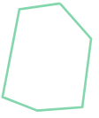

In Natural Earth's dataset all borders/shapes are described in a clockwise order, which is something that will come in handy later on! My code is based on it being
anticlockwise, but all that means is that we have to reverse the data.

## Placing coordinates in 3D space

Coordinates describe points on a sphere, but we want points in 3D.
The following function transforms a coordinate into a point in 3D space on a sphere of radius 1.

```py
def coord_on_sphere(x, y) -> np.ndarray:
    """Translate (lon,lat) point to a point on a 3D sphere"""
    radian_ratio = math.pi / 180
    x1 = math.cos(y * radian_ratio)
    y1 = 0
    z1 = math.sin(y * radian_ratio)

    # rotate around z axis
    cos_theta = math.cos(x * radian_ratio)
    sin_theta = math.sin(x * radian_ratio)
    x2 = cos_theta * x1
    y2 = sin_theta * x1

    return np.array((x2, y2, z1))
```

If we then write all of these 3D points to an [.OBJ](https://en.wikipedia.org/wiki/Wavefront_.obj_file) file and connect them using [lines](https://en.wikipedia.org/wiki/Wavefront_.obj_file#Line_elements) we get the result in [[perfect-lines]]. From a distance this looks good, but if we overlay this on a spherical object we see some strange artefacts seen in [[faulty-lines]].

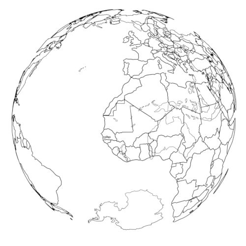 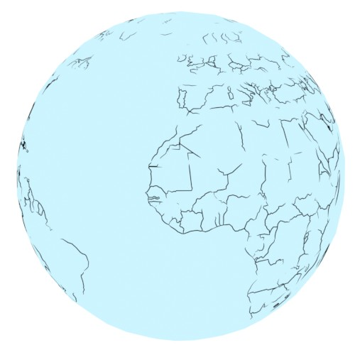

It looks like our lines are going straight through the sphere! While our points do lie on the surface, the lines are just that: straight lines, meaning they don't follow the sphere's surface.
We will need to come up with a solution to make the lines live on the surface.

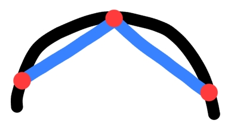

## Journey to the center of the Earth

So far we've been working with a perfect sphere. 3D meshes are made up of flat triangles and non-curved lines. Spheres on the other hand are famous for being very round and not having any flat surfaces; not a great combination.
This means that any spherical mesh is just an approximation of the real thing. The more triangles we use, the closer we get to an actual sphere.

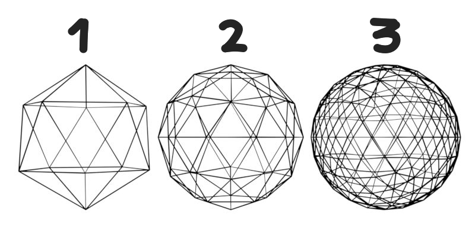

We will continue for now with a low res icosahedron (number 1 in [[3icos-numbers]]) as it's easier to visualise what is going on. You'll see later that we can use all sorts of shapes as a base!

In order to connect our points with straight lines that seemingly lie on a sphere we will have to use one of these approximations as our base and so our points need to lie on this base.
The easiest is to project all our points towards the center of the sphere, and create the projected point on the intersection with our base. This is the method I ended up using.

The general implementation looks something like this:
```py
P = Point(p1, p2, p3)
O = Point(0, 0, 0)
for triangle in base_mesh:
    P_prime: Point = intersection(triangle, P, O)
    if P_prime is not None:
        return P_prime
```

Now all our points live on this spherical approximation, consisting of triangles.

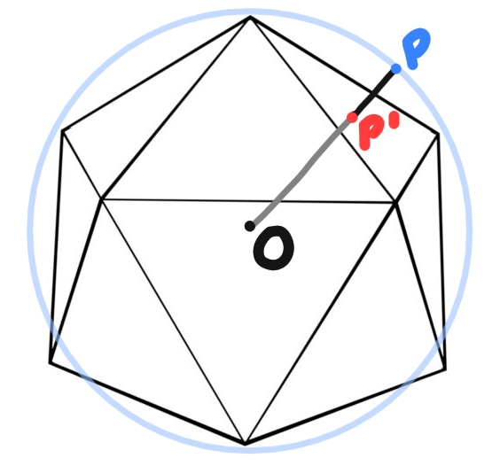 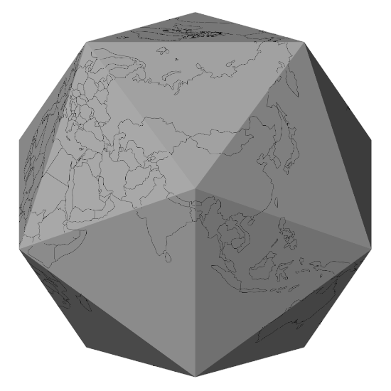


## Connecting the dots

Wait a second, let's zoom in a bit around the edges of our icosahedron ... that doesn't look right, it seems we are losing some of our outlines again.

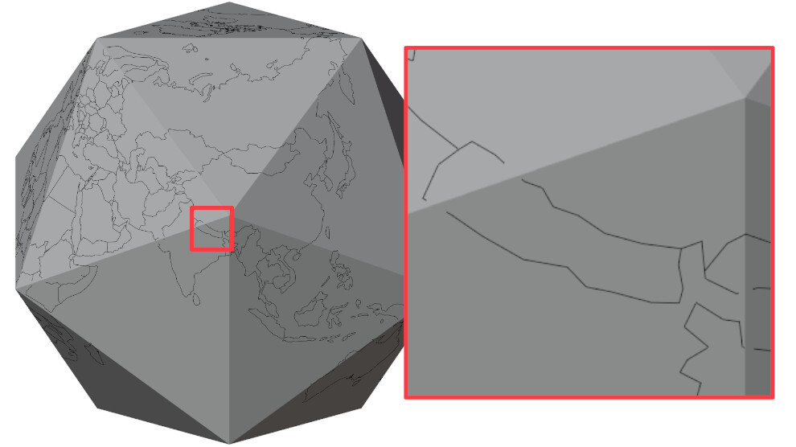

Whenever all points lie on a single triangle there is no issue, but when 2 connected points lie on different triangles we have the same problem as before where the line goes through the surface.
If we name these 2 "problematic" points **A** and **B**, then we want to transform line **AB** so that it follows the surface.
In order to do that we just split up **AB** into 2 separate lines **AE** and **EB** where **E** is a point on the edge **e** that the 2 triangles have in common. This way **AE** lies completely on the same triangle **A** lives on, and the same goes for **EB** and **B**.

Sounds easy enough, but where does **E** lie exactly? In the middle of the edge or closer to one of its points?
The exact position of **E** is defined in such a way that the sum both lines is as as small as possible, meaning **min(|AE| + |EB|)**.
There might be a cool formula for this, but I went with an iterative approach:
```py
# Find the edge between point A and B
T1 = Triangle(A)
T2 = Triangle(B)
e = shared_edge(T1, T2)

# Can be repeated as many times as we want, 15 gives accurate enough results
for i in range(15):
    # Get 3 equally spaced points on e 
    X, Y, Z = subdivide(e, 4)
    if distance(A, X) + distance(X, B) < distance(A, Z) + distance(Z, B):
        e = (X, Y)
    else:
        e = (Y, Z)

return Y
```


### Crossing multiple triangles

Some connected points lie on triangles that don't border each other. In that case we will have to do the above algorithm a few times for each triangle inbetween.
To decide what triangles lie in the middle we do the following:

```py
def connect_2_points(A, B):
    if on_neighbouring_triangles(A, B):
        return

    # Get a point in the middle of A and B
    P = subdivide(A, B, 2)
    # Scale P so it lies outside of our sphere
    P *= 2

    O = Point(0, 0, 0)
    for triangle in base_mesh:
        C: Point = intersection(triangle, P, O)
        if C is not None:
            add_point_to_mesh(C)
            connect_2_points(A, C)
            connect_2_points(C, B)
            break
```

Once all points are on neighbouring triangles we can apply algorithm one again.


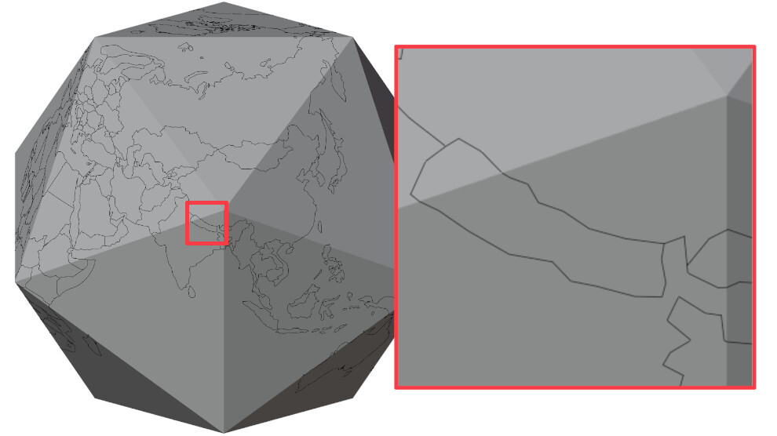

That looks pretty good already! In fact it satisfies all of our requrements except 1.
* We can add region borders the same way as we did country borders.
* Since the borders are not defined by pixels, but are drawn dynamically, they will always appear clear no matter how far zoomed in we are or where they are located on the globe.

But since these are just outlines, we can't actually colour in the countries. What we need is a surface to draw on; aka a mesh. 
If I had known what work was ahead of me at this point, I would have compromised and stopped here.
But I didn't so let's continue!

## Nation triangulation

Up until now we've only created outlines of countries, but meshes consist of triangles, not lines.
Luckily there already exist some triangulation algorithms that are not that hard to implement, like the [ear clipping algorithm](https://nils-olovsson.se/articles/ear_clipping_triangulation/).
This will allow us to divide our shapes (countries) into individual triangles that describe our mesh.

The algorithm is quite simple, but it only works in 2D.
1. Countries that cover only one triangle of the base are essentially already a 2D shape and the triangle they lie on is "flat". We can thus do a simple transformation where the triangle is transformed so it lays flat on the XY plane, and ignore the Z axis (which will then be 0).
1. Countries that span multiple triangles of the base will have to be split into segments that each lie completely on a single triangle of the base. Each segment can then be treated like in the first point.

### Redraw the borders

For point `2.` I'll use Uganda as an example, as one of the icosahedron's points lies nicely in the middle.
The end goal is to split the country up into 6 parts, that each lie completely on one the icosahedron's triangles.

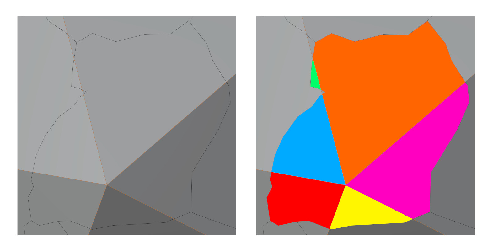

In a first pass, we will collect all points per edge and sort them based on their distance to one of the edge points. 
Which one of the two we measure against doesn't matter, as long as we stay consistent.

)")

In [[uganda-numbered]] you can see all vertices that lie on an edge marked by an index which is just their order in the shape as a whole. The result of sorting looks as follows:

```py
{
    (4, 8): [
        (index=8,  distance=0),
        (index=4,  distance=0.075)
    ],
    (1, 8): [        
        (index=8,  distance=0),
        (index=17, distance=0.042),
        (index=15, distance=0.046),
        (index=13, distance=0.056),
    ],
    (10, 8): [
        (index=8,  distance=0),
        (index=22, distance=0.037)
    ],
    (3, 8): [
        (index=8,  distance=0),
        (index=29, distance=0.022)
    ],
    (5, 8): [
        (index=8,  distance=0),
        (index=31, distance=0.034)
    ],
} 
```

We always traverse the shape in a anticlockwise order in order to:
1. Stay consistent
1. Decide whether base corners/vertices (8 in this case) are also part of our shape or not.  

By traversing the shape in a anticlockwise manner, every time an edge is crossed we can use our sorted list of vertices to "look to our left" and see what type of vertex we see first. If it's another vertex that is part of the shape, we just continue. If it's a corner vertex of the base shape (essentially 1 vertex of the edge being crossed) then we can include it.
[[corner-out]] describes the former, [[corner-in]] the latter.

In Uganda's example ([[uganda-numbered]]) we have the following:
* Left of `13` is `15`
* Left of `15` is `13`
* Left of `17` is `8`: This tells us `8` is a vertex that needs to be included


TODO create the individual shapes.

### Chop up the pieces

Now that we've divided the country up in smaller shapes that lie completely on a single plane (a triangle of the icosahedron) all that's left is triangulating these shapes. The ear-clipping algorithm mentioned earlier can only be applied in 2D, so we have to transform our 3D shape so it lies flat on the XY plane, essentially turning it 2D. 
We apply the algorithm, transform back into 3D and that's it!

Doing this for every single country means our project is complete! 

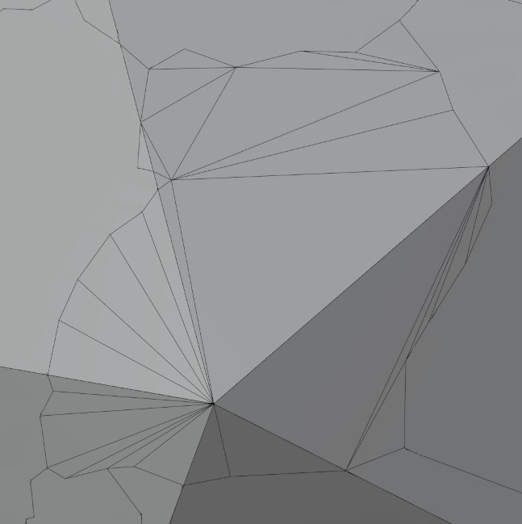 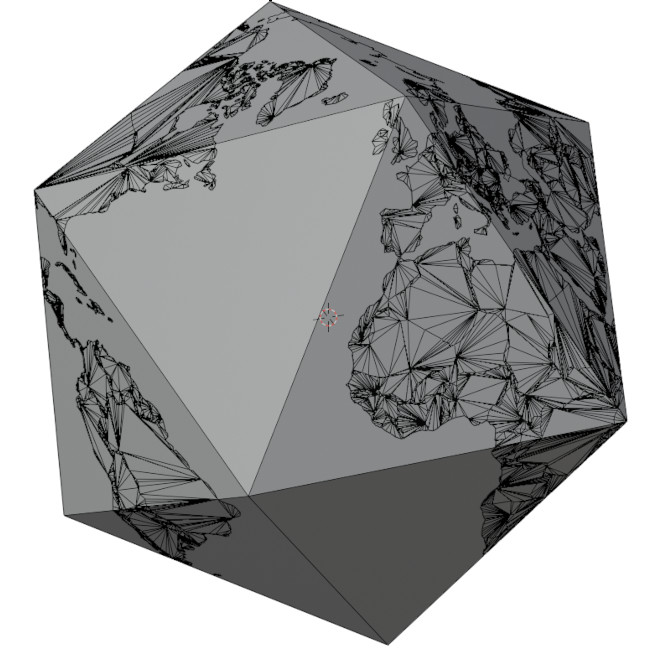

## Based on what?

We can choose other shapes than the icosahedron. [[different-bases]] shows a few different ones. Unfortunately, it's not possible to use just any shape due to the projection that is used. Since all spherical points are projected towards the center, it's expected that there will be something to project onto. A torus which has a hole in the middle will not be able to acommodate points projected from the North and South Pole.

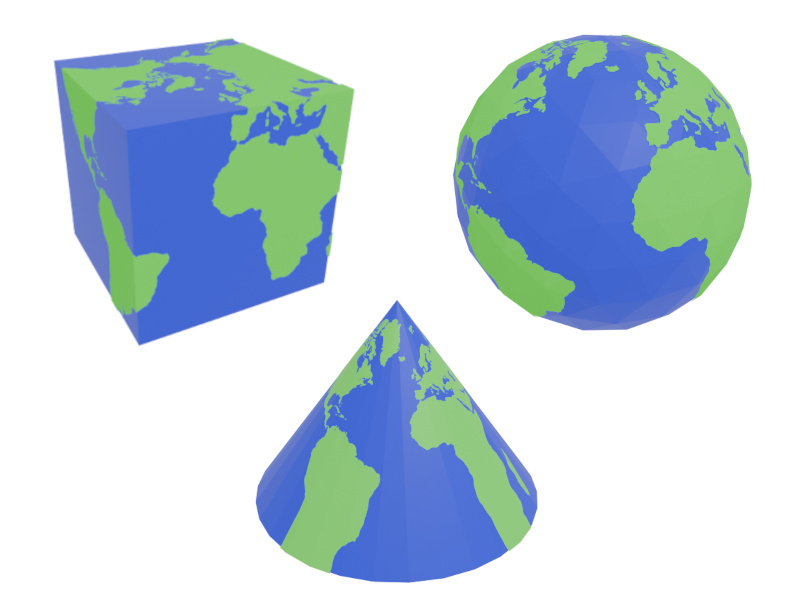

## Conclusion

Phew, what a journey.

I brushed over a lot of details, and even decided to leave out whole parts as there's just too much to talk about. I hope it does give a bit of an overview and can serve as a guideline to anyone who is trying to achieve something similar. 
If you're interested, all code is available on [the github page](https://github.com/AtishaRibeiro/globe).
